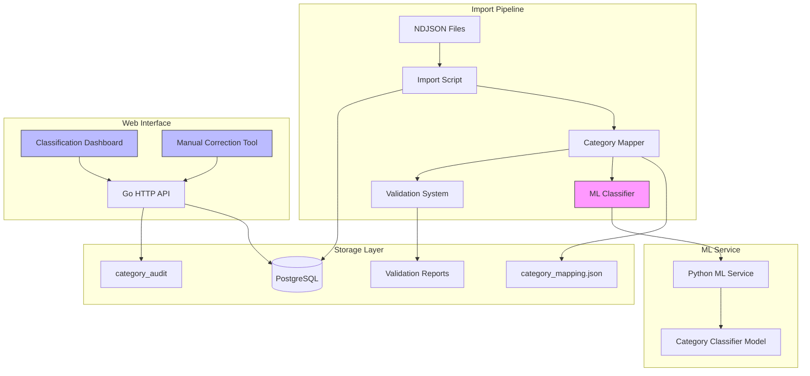

# Design Document: Clothing Category Classification Improvement

## Overview

This design addresses the critical data quality issues in the clothing category classification system that are blocking ranker model training. The current implementation uses a hardcoded `mapCategory` function with incomplete subcategory lists, resulting in incorrect category assignments and excessive use of the "upper" fallback value.

The solution introduces a multi-layered approach:

1. **Monitoring Dashboard** - Real-time visibility into category distribution and mapping issues
2. **Enhanced Category Mapping** - Comprehensive configuration-driven mapping with 40+ subcategories
3. **ML-Based Classification** - Intelligent classification for unknown items with confidence scoring
4. **Manual Correction Tools** - Web interface for data scientists to fix misclassifications
5. **Import Validation** - Real-time validation during catalog import with detailed reporting
6. **Audit Trail** - Complete history of category changes for model training and quality analysis

The system maintains backward compatibility with existing import workflows while adding new capabilities for monitoring, validation, and correction.

## Architecture

### System Components



### Component Responsibilities

**Category Mapper**
- Loads mapping rules from JSON configuration file
- Performs case-insensitive subcategory lookup
- Delegates unknown subcategories to ML Classifier
- Logs warnings for unmapped subcategories
- Supports hot-reload of configuration

**ML Classifier**
- HTTP client to Python ML service
- Sends item attributes (name, subcategory, materials, style)
- Receives category prediction with confidence score
- Applies confidence thresholds (>0.8 auto-assign, 0.5-0.8 flag for review)
- Handles service unavailability gracefully

**Validation System**
- Runs during import batch processing
- Tracks unknown subcategories and fallback usage
- Generates validation reports with statistics
- Triggers error-level alerts when fallback usage >10%
- Stores reports with timestamps for historical analysis

**Classification Dashboard**
- Web UI displaying category distribution metrics
- Shows total counts and percentages per category
- Lists subcategories mapped to each category
- Highlights unmapped subcategories
- Displays last import timestamp
- Auto-refreshes after import completion

**Manual Correction Tool**
- Web UI for browsing and editing clothing items
- Supports filtering by category, subcategory,
**:
```go
type CategoryMapper interface {
    // MapCategory maps a subcategory to a category using configuration rules
    MapCategory(category, subcategory string) (string, error)

    // MapCategoryWithML attempts ML classification for unknown subcategories
    MapCategoryWithML(ctx context.Context, item *ClothingItem) (category string, confidence float64, err error)

    // ReloadConfig hot-reloads the mapping configuration
    ReloadConfig() error

    // GetUnmappedSubcategories returns list of subcategories without mappings
    GetUnmappedSubcategories() []string
}

type CategoryMappingConfig struct {
    Mappings map[string]string `json:"mappings"` // subcategory -> category
    Fallback string             `json:"fallback"` // default category
    Version  string             `json:"version"`  // config version
}
```

**Configuration File**: `server/config/category_mapping.json`

```json
{
  "version": "1.0.0",
  "fallback": "upper",
  "mappings": {
    "t-shirt": "upper",
    "shirt": "upper",
    "blouse": "upper",
    "sweater": "upper",
    "hoodie": "upper",
    "vest": "upper",
    "top": "upper",
    "jeans": "lower",
    "pants": "lower",
    "trousers": "lower",
    "shorts": "lower",
    "skirt": "lower",
    "leggings": "lower",
    "trackpants": "lower",
    "jacket": "outerwear",
    "coat": "outerwear",
    "parka": "outerwear",
    "raincoat": "outerwear",
    "puffer": "outerwear",
    "blazer": "outerwear",
    "windbreaker": "outerwear",
    "shoes": "footwear",
    "sneakers": "footwear",
    "boots": "footwear",
    "sandals": "footwear",
    "loafers": "footwear",
    "oxford": "footwear",
    "slippers": "footwear",
    "heels": "footwear",
    "hat": "accessory",
    "cap": "accessory",
    "scarf": "accessory",
    "gloves": "accessory",
    "belt": "accessory",
    "bag": "accessory",
    "watch": "accessory",
    "sunglasses": "accessory",
    "jewelry": "accessory"
  }
}
```

### 2. ML Classifier Client (Go)

**Location**: `server/internal/ml/classifier_client.go`

**Interface**:
```go
type ClassifierClient interface {
    // ClassifyItem predicts category for a clothing item
    ClassifyItem(ctx context.Context, req *ClassifyRequest) (*ClassifyResponse, error)

    // HealthCheck verifies ML service availability
    HealthCheck(ctx context.Context) error
}

type ClassifyRequest struct {
    Name        string   `json:"name"`
    Subcategory string   `json:"subcategory"`
    Materials   []string `json:"materials"`
    Style       string   `json:"style"`
}

type ClassifyResponse struct {
    Category   string  `json:"category"`
    Confidence float64 `json:"confidence"`
}
```

**HTTP Endpoint**: `POST /api/v1/classify`

### 3. ML Classifier Service (Python)

**Location**: `ml-service/services/category_classifier.py`

**Interface**:
```python
class CategoryClassifier:
    def classify(self, item: ClassifyRequest) -> ClassifyResponse:
        """Predicts category with confidence score"""
        pass

    def train(self, training_data: List[TrainingExample]) -> None:
        """Trains classifier on corrected data"""
        pass
```

**Model**: Lightweight text classification model (e.g., scikit-learn LogisticRegression or small transformer)
- Input features: TF-IDF of name + subcategory, one-hot encoded materials/style
- Output: 5-class classification (outerwear, upper, lower, footwear, accessory)
- Training data: Manually corrected items from audit trail

### 4. Validation System (Go)

**Location**: `server/internal/catalog/validator.go`

**Interface**:
```go
type ImportValidator interface {
    // ValidateBatch validates a batch of items during import
    ValidateBatch(ctx context.Context, items []*ClothingItem) *ValidationReport

    // GenerateReport creates a validation report file
    GenerateReport(report *ValidationReport, outputPath string) error
}

type ValidationReport struct {
    Timestamp         time.Time
    TotalItems        int
    UnknownSubcats    map[string]int // subcategory -> count
    FallbackCount     int
    FallbackPercent   float64
    CategoryDist      map[string]int // category -> count
    MLClassified      int
    MLHighConfidence  int
    MLLowConfidence   int
}
```

**Report Storage**: `server/validation_reports/import_YYYYMMDD_HHMMSS.json`

### 5. Classification Dashboard API (Go)

**Location**: `server/internal/api/handlers/classification_handler.go`

**Endpoints**:
```go
// GET /api/v1/classification/metrics
type MetricsResponse struct {
    TotalItems        int                    `json:"total_items"`
    CategoryDist      map[string]int         `json:"category_distribution"`
    CategoryPercent   map[string]float64     `json:"category_percentages"`
    SubcategoryMap    map[string][]SubcatInfo `json:"subcategory_mappings"`
    UnmappedSubcats   []UnmappedInfo         `json:"unmapped_subcategories"`
    LastImportAt      *time.Time             `json:"last_import_at"`
    ManualCorrections int                    `json:"manual_corrections"`
}

type SubcatInfo struct {
    Subcategory string `json:"subcategory"`
    Count       int    `json:"count"`
}

type UnmappedInfo struct {
    Subcategory string `json:"subcategory"`
    Count       int    `json:"count"`
    FallbackCat string `json:"fallback_category"`
}

// GET /api/v1/classification/category/{category}/breakdown
type CategoryBreakdownResponse struct {
    Category      string         `json:"category"`
    TotalCount    int            `json:"total_count"`
    Subcategories []SubcatInfo   `json:"subcategories"`
}
```

### 6. Manual Correction Tool API (Go)

**Location**: `server/internal/api/handlers/correction_handler.go`

**Endpoints**:
```go
// GET /api/v1/clothing-items?category=upper&subcategory=shirt&page=1&limit=50
type ListItemsResponse struct {
    Items      []ClothingItemDTO `json:"items"`
    Total      int               `json:"total"`
    Page       int               `json:"page"`
    TotalPages int               `json:"total_pages"`
}

type ClothingItemDTO struct {
    ID            string    `json:"id"`
    Name          string    `json:"name"`
    Category      string    `json:"category"`
    Subcategory   string    `json:"subcategory"`
    Materials     []string  `json:"materials"`
    Style         string    `json:"style"`
    Source        string    `json:"source"`
    Confidence    *float64  `json:"confidence,omitempty"`
    LastCorrected *time.Time `json:"last_corrected,omitempty"`
}

// PATCH /api/v1/clothing-items/{id}/category
type UpdateCategoryRequest struct {
    Category string  `json:"category"`
    Reason   *string `json:"reason,omitempty"`
}

// POST /api/v1/clothing-items/bulk-update
type BulkUpdateRequest struct {
    ItemIDs  []string `json:"item_ids"`
    Category string   `json:"category"`
    Reason   *string  `json:"reason,omitempty"`
}
```

### 7. Audit Trail (Database)

**Migration**: `server/migrations/000021_category_audit.up.sql`

```sql
CREATE TABLE category_audit (
    id UUID PRIMARY KEY DEFAULT gen_random_uuid(),
    item_id UUID NOT NULL REFERENCES clothing_items(id) ON DELETE CASCADE,
    old_category TEXT NOT NULL,
    new_category TEXT NOT NULL,
    changed_by TEXT NOT NULL, -- 'import', 'ml_classifier', or user_id
    changed_at TIMESTAMPTZ NOT NULL DEFAULT now(),
    reason TEXT,
    confidence NUMERIC(4,3), -- ML confidence score if applicable

    CONSTRAINT category_audit_category_check
        CHECK (old_category IN ('outerwear','upper','lower','footwear','accessory') AND
               new_category IN ('outerwear','upper','lower','footwear','accessory'))
);

CREATE INDEX idx_category_audit_item ON category_audit(item_id);
CREATE INDEX idx_category_audit_changed_at ON category_audit(changed_at DESC);
CREATE INDEX idx_category_audit_changed_by ON category_audit(changed_by);

-- Add confidence field to clothing_items for ML classifications
ALTER TABLE clothing_items ADD COLUMN classification_confidence NUMERIC(4,3);
ALTER TABLE clothing_items ADD COLUMN classification_source TEXT DEFAULT 'mapping'
    CHECK (classification_source IN ('mapping', 'ml_auto', 'ml_flagged', 'manual'));
```

**Export Endpoint**:
```go
// GET /api/v1/classification/audit/export?from=2024-01-01&to=2024-12-31
// Returns CSV file with audit trail data
```

## Data Models

### Enhanced ClothingItem Model

```go
type ClothingItem struct {
    ID                       uuid.UUID
    ExternalID               int64
    Name                     string
    Category                 string
    Subcategory              string
    Gender                   string
    Style                    string
    Usage                    string
    Season                   string
    BaseColour               *string
    FormalityLevel           int
    WarmthLevel              int
    MinTemp                  int
    MaxTemp                  int
    Materials                []string
    Fit                      *string
    Pattern                  *string
    IconEmoji                string
    Source                   string
    IsOwned                  bool
    IsActive                 bool

    // New fields for classification tracking
    ClassificationConfidence *float64 // ML confidence score
    ClassificationSource     string   // 'mapping', 'ml_auto', 'ml_flagged', 'manual'

    CreatedAt                time.Time
    UpdatedAt                time.Time
}
```

### CategoryAudit Model

```go
type CategoryAudit struct {
    ID          uuid.UUID
    ItemID      uuid.UUID
    OldCategory string
    NewCategory string
    ChangedBy   string    // 'import', 'ml_classifier', or user UUID
    ChangedAt   time.Time
    Reason      *string
    Confidence  *float64  // ML confidence if applicable
}
```

### ValidationReport Model

```go
type ValidationReport struct {
    Timestamp         time.Time
    TotalItems        int
    UnknownSubcats    map[string]int
    FallbackCount     int
    FallbackPercent   float64
    CategoryDist      map[string]int
    MLClassified      int
    MLHighConfidence  int  // confidence > 0.8
    MLLowConfidence   int  // confidence 0.5-0.8
    Errors            []string
    Warnings          []string
}
```

### Import Metadata Tracking

```sql
CREATE TABLE import_metadata (
    id UUID PRIMARY KEY DEFAULT gen_random_uuid(),
    filename TEXT NOT NULL,
    started_at TIMESTAMPTZ NOT NULL,
    completed_at TIMESTAMPTZ,
    total_items INT NOT NULL DEFAULT 0,
    successful_items INT NOT NULL DEFAULT 0,
    skipped_items INT NOT NULL DEFAULT 0,
    validation_report_path TEXT,
    status TEXT NOT NULL DEFAULT 'running' CHECK (status IN ('running', 'completed', 'failed'))
);

CREATE INDEX idx_import_metadata_completed_at ON import_metadata(completed_at DESC);
```

## Correctness Properties

*A property is a characteristic or behavior that should hold true across all valid executions of a system—essentially, a formal statement about what the system should do. Properties serve as the bridge between human-readable specifications and machine-verifiable correctness guarantees.*

### Property Reflection

After analyzing all acceptance criteria, I identified several areas where properties can be consolidated:

- **Dashboard metrics properties (1.1, 1.2, 1.3)** can be combin
omprehensive validation coverage:

### Property 1: Category Distribution Accuracy

*For any* set of clothing items in the database, the dashboard metrics should accurately reflect the actual distribution where the sum of all category counts equals the total item count, and each category percentage equals (category_count / total_count) * 100.

**Validates: Requirements 1.1, 1.2**

### Property 2: Subcategory Grouping Correctness

*For any* category, the dashboard's subcategory breakdown should include all and only those items whose category field matches the selected category, grouped by their subcategory values with accurate counts.

**Validates: Requirements 1.3, 1.5**

### Property 3: Unmapped Subcategory Detection

*For any* subcategory that does not exist in the mapping configuration, items with that subcategory should appear in the unmapped subcategories list with the fallback category assigned.

**Validates: Requirements 1.4, 2.7**

### Property 4: ML Confidence Score Range

*For any* item classified by the ML service, the confidence score must be a value between 0 and 1 inclusive.

**Validates: Requirements 3.2**

### Property 5: High Confidence Auto-Assignment

*For any* item where the ML classifier returns a confidence score above 0.8, the system should automatically assign the predicted category and set classification_source to 'ml_auto'.

**Validates: Requirements 3.3**

### Property 6: Low Confidence Flagging

*For any* item where the ML classifier returns a confidence score between 0.5 and 0.8 inclusive, the system should flag the item for manual review by setting classification_source to 'ml_flagged'.

**Validates: Requirements 3.4**

### Property 7: Category Filter Correctness

*For any* category filter applied in the manual correction tool, all returned items should have a category field matching the filter value, and no items with different categories should be included.

**Validates: Requirements 4.1, 4.2**

### Property 8: Category Update Validation

*For any* category update request, if the new category value is not one of the five allowed values ('outerwear', 'upper', 'lower', 'footwear', 'accessory'), the update should be rejected with a validation error.

**Validates: Requirements 4.6**

### Property 9: Audit Trail Creation on Update

*For any* successful category change (single or bulk), an audit record must be created containing the item_id, old_category, new_category, changed_by, changed_at timestamp, and optional reason.

**Validates: Requirements 4.5, 7.2, 7.3**

### Property 10: Bulk Update Atomicity

*For any* bulk update request with N item IDs, either all N items should be updated and N audit records created, or none should be updated (transaction atomicity).

**Validates: Requirements 4.7**

### Property 11: Unknown Subcategory Detection in Validation

*For any* import batch containing items with subcategories not in the mapping configuration, the validation system should detect and list all unique unknown subcategories in the validation report.

**Validates: Requirements 5.1, 5.2**

### Property 12: Fallback Usage Tracking

*For any* import batch, the validation report's fallback count should equal the number of items where the subcategory was not found in the mapping configuration and ML classification was not used or unavailable.

**Validates: Requirements 5.3**

### Property 13: Fallback Threshold Alert

*For any* import batch where the fallback usage percentage exceeds 10%, the validation system should log an error-level message and include a warning in the validation report.

**Validates: Requirements 5.4**

### Property 14: Validation Report Generation

*For any* completed import operation, a validation report file should be created in the designated directory with a filename containing a timestamp, and the report should contain category distribution statistics.

**Validates: Requirements 5.5, 5.6**

### Property 15: ML Fallback Chain Priority

*For any* unknown subcategory during import, if the ML classifier service is available and returns a prediction, that prediction should be used instead of the default fallback category.

**Validates: Requirements 5.7**

### Property 16: Invalid Configuration Fallback

*For any* invalid or malformed configuration file (invalid JSON, missing required fields, invalid category values), the category mapper should log an error and continue operating using hardcoded default mappings.

**Validates: Requirements 6.4**

### Property 17: Configuration Reload Validation

*For any* configuration reload operation, if the new configuration contains invalid mapping rules (e.g., mapping to non-existent categories), the reload should be rejected and the previous valid configuration should remain active.

**Validates: Requirements 6.6**

### Property 18: Original Category Recording

*For any* clothing item imported into the system, the initial category assignment (whether from mapping, ML, or fallback) should be recorded, enabling tracking of whether the item has been subsequently modified.

**Validates: Requirements 7.1**

### Property 19: Manual Correction Training Data

*For any* clothing item that has been manually corrected (has audit records with changed_by != 'import' and != 'ml_classifier'), the corrected category should be available for export and use in ML classifier training.

**Validates: Requirements 7.7**

## Error Handling

### Category Mapper Errors

**Configuration Loading Failures**
- Invalid JSON syntax → Log error, use hardcoded defaults, continue operation
- Missing required fields → Log error, use hardcoded defaults
- Invalid category values in mappings → Log warning, skip invalid mappings, use valid ones

**Runtime Mapping Errors**
- Unknown subcategory → Log warning with subcategory value, attempt ML classification, fall back to default
- Empty/null subcategory → Skip item during import, increment skipped counter
- Case sensitivity issues → Normalize to lowercase before lookup

### ML Classifier Errors

**Service Unavailability**
- Connection timeout → Log warning, fall back to default category mapping
- Service returns 5xx error → Log error, retry once, then fall back
- Network errors → Log error, fall back immediately

**Invalid Responses**
- Confidence score out of range → Log error, treat as low confidence (flag for review)
- Invalid category in response → Log error, use fallback category
- Malformed JSON → Log error, fall back to default mapping

**Timeout Handling**
- Set 50ms timeout for classification requests
- If timeout exceeded, log warning and use fallback
- Track timeout rate for monitoring

### Database Errors

**Import Transaction Failures**
- Constraint violation → Rollback batch, log error with item details, continue with next batch
- Deadlock → Retry transaction up to 3 times with exponential backoff
- Connection loss → Fail import, log error, preserve partial progress via transaction boundaries

**Audit Trail Failures**
- Audit insert failure → Rollback category update (maintain consistency)
- Audit table full/dis
with details, continue import

**Validation Logic Errors**
- Division by zero (empty batch) → Handle gracefully, report 0% fallback usage
- Negative counts (data inconsistency) → Log error, use absolute values, flag for investigation

### API Error Responses

**Client Errors (4xx)**
- 400 Bad Request: Invalid category value, malformed request body
- 404 Not Found: Item ID doesn't exist
- 422 Unprocessable Entity: Business logic validation failure (e.g., bulk update with no items)

**Server Errors (5xx)**
- 500 Internal Server Error: Unexpected errors, log full stack trace
- 503 Service Unavailable: Database connection pool exhausted, ML service down
- 504 Gateway Timeout: ML classifier timeout exceeded

### Graceful Degradation

**ML Service Unavailable**
- System continues operating with configuration-based mapping only
- Dashboard shows "ML Classification: Unavailable" status
- Validation reports note ML service status

**Configuration File Missing**
- Use hardcoded default mappings from code
- Log error on startup
- Dashboard shows "Configuration: Using Defaults" warning

**Audit Trail Disabled**
- If audit table doesn't exist, log warning but allow category updates
- Manual corrections still work, just without history tracking
- Dashboard hides audit-related metrics

## Testing Strategy

### Dual Testing Approach

This feature requires both unit tests and property-based tests for comprehensive coverage:

- **Unit tests** validate specific examples, edge cases, and integration points
- **Property-based tests** verify universal properties across randomized inputs
- Together they ensure both concrete correctness and general behavior

### Unit Testing

**Category Mapper Tests** (`server/internal/catalog/category_mapper_test.go`)
- Test specific mappings from requirements 2.2-2.6 (t-shirt→upper, jeans→lower, etc.)
- Test configuration loading with valid and invalid JSON
- Test hot-reload functionality
- Test case-insensitive matching (T-Shirt, t-shirt, T-SHIRT all map to upper)
- Test empty/null subcategory handling

**ML Classifier Client Tests** (`server/internal/ml/classifier_client_test.go`)
- Test successful classification with mock ML service
- Test timeout handling (mock slow service)
- Test service unavailability (connection refused)
- Test malformed response handling
- Test retry logic for transient failures

**Validation System Tests** (`server/internal/catalog/validator_test.go`)
- Test report generation with known data
- Test fallback threshold detection (exactly 10%, 11%, 9%)
- Test unknown subcategory detection
- Test report file creation and naming
- Test validation with ML service available vs unavailable

**API Handler Tests** (`server/internal/api/handlers/*_test.go`)
- Test dashboard metrics endpoint with known database state
- Test category breakdown endpoint
- Test manual correction endpoints (single and bulk update)
- Test filtering and pagination
- Test audit trail export endpoint
- Test error responses (400, 404, 422, 500)

**Database Integration Tests** (`server/test/integration/category_test.go`)
- Test audit trail creation on category updates
- Test transaction rollback on errors
- Test concurrent updates (race conditions)
- Test foreign key constraints

### Property-Based Testing

We will use **Rapid** (https://github.com/flyingmutant/rapid) for property-based testing in Go. Each test should run minimum 100 iterations.

**Configuration**: Each property test must include a comment tag referencing the design document property:
```go
// Feature: clothing-category-classification-improvement, Property 1: Category Distribution Accuracy
func TestProperty_CategoryDistributionAccuracy(t *testing.T) {
    rapid.Check(t, func(t *rapid.T) {
        // test implementation
    })
}
```

**Property Test Suite** (`server/internal/catalog/properties_test.go`)

**Property 1: Category Distribution Accuracy**
```go
// Feature: clothing-category-classification-improvement, Property 1: Category Distribution Accuracy
func TestProperty_CategoryDistributionAccuracy(t *testing.T)
```
- Generate: Random set of clothing items with random categories
- Action: Insert into database, query dashboard metrics
- Assert: Sum of category counts == total count, percentages sum to ~100% (within floating point tolerance)

**Property 2: Subcategory Grouping Correctness**
```go
// Feature: clothing-category-classification-improvement, Property 2: Subcategory Grouping Correctness
func TestProperty_SubcategoryGroupingCorrectness(t *testing.T)
```
- Generate: Random category, random set of items with various categories/subcategories
- Action: Query category breakdown endpoint
- Assert: All returned items have matching category, counts are accurate

**Property 3: Unmapped Subcategory Detection**
```go
// Feature: clothing-category-classification-improvement, Property 3: Unmapped Subcategory Detection
func TestProperty_UnmappedSubcategoryDetection(t *testing.T)
```
- Generate: Random unknown subcategory (not in config), random item with that subcategory
- Action: Import item, query unmapped subcategories
- Assert: Unknown subcategory appears in unmapped list, item has fallback category

**Property 4: ML Confidence Score Range**
```go
// Feature: clothing-category-classification-improvement, Property 4: ML Confidence Score Range
func TestProperty_MLConfidenceScoreRange(t *testing.T)
```
- Generate: Random clothing item attributes
- Action: Call ML classifier
- Assert: Confidence score is in [0, 1] range

**Property 5: High Confidence Auto-Assignment**
```go
// Feature: clothing-category-classification-improvement, Property 5: High Confidence Auto-Assignment
func TestProperty_HighConfidenceAutoAssignment(t *testing.T)
```
- Generate: Random item, mock ML response with confidence > 0.8
- Action: Process item through classification
- Assert: Item category matches ML prediction, classification_source == 'ml_auto'

**Property 6: Low Confidence Flagging**
```go
// Feature: clothing-category-classification-improvement, Property 6: Low Confidence Flagging
func TestProperty_LowConfidenceFlagging(t *testing.T)
```
- Generate: Random item, mock ML response with confidence in [0.5, 0.8]
- Action: Process item through classification
- Assert: classification_source == 'ml_flagged'

**Property 7: Category Filter Correctness**
```go
// Feature: clothing-category-classification-improvement, Property 7: Category Filter Correctness
func TestProperty_CategoryFilterCorrectness(t *testing.T)
```
- Generate: Random category, random set of items with various categories
- Action: Query correction tool API with category filter
- Assert: All returned items have matching category

**Property 8: Category Update Validation**
```go
// Feature: clothing-category-classification-improvement, Property 8: Category Update Validation
func TestProperty_CategoryUpdateValidation(t *testing.T)
```
- Generate: Random item, random invalid category string (not in allowed list)
- Action: Attempt category update
- Assert: Update rejected with validation error

**Property 9: Audit Trail Creation on Update**
```go
// Feature: clothing-category-classification-improvement, Property 9: Audit Trail Creation on Update
func TestProperty_AuditTrailCreationOnUpdate(t *testing.T)
```
- Generate: Random item, random valid new category
- Action: Update item category
- Assert: Audit record exists with correct old/new categories, timestamp, changed_by

**Property 10: Bulk Update Atomicity**
```go
// Feature: clothing-category-classification-improvement, Property 10: Bulk Update Atomicity
func TestProperty_BulkUpdateAtomicity(t *testing.T)
```
- Generate: Random list of N item IDs (some valid, some invalid)
- Action: Attempt bulk update
- Assert: Either all valid items updated + N audit records, or none updated (on any error)

**Property 11: Unknown Subcategory Detection in Validation**
```go
// Feature: clothing-category-classification-improvement, Property 11: Unknown Subcategory Detection in Validation
func TestProperty_UnknownSubcategoryDetectionInValidation(t *testing.T)
```
- Generate: Random batch with some unknown subcategories
- Action: Run validation
- Assert: All unknown subcategories appear in validation report

**Property 12: Fallback Usage Tracking**
```go
// Feature: clothing-category-classification-improvement, Property 12: Fallback Usage Tracking
func TestProperty_FallbackUsageTracking(t *testing.T)
```
- Generate: Random batch with known mix of mapped/unmapped subcategories
- Action: Import batch, generate validation report
- Assert: Fallback count matches number of unmapped items

**Property 13: Fallback Threshold Alert**
```go
// Feature: clothing-category-classification-improvement, Property 13: Fallback Threshold Alert
func TestProperty_FallbackThresholdAlert(t *testing.T)
```
- Generate: Random batch with >10% unmapped subcategories
- Action: Run validation
- Assert: Error-level log message present, warning in report

**Property 14: Validation Report Generation**
```go
// Feature: clothing-category-classification-improvement, Property 14: Validation Report Generation
func TestProperty_ValidationReportGeneration(t *testing.T)
```
- Generate: Random import batch
- Action: Complete import
- Assert: Report file exists with timestamp in name, contains category distribution

**Property 15: ML Fallback Chain Priority**
```go
// Feature: clothing-category-classification-improvement, Property 15: ML Fallback Chain Priority
func TestProperty_MLFallbackChainPriority(t *testing.T)
```
- Generate: Random unknown subcategory, mock ML service available
- Action: Import item
- Assert: Item category matches ML prediction, not default fallback

**Property 16: Invalid Configuration Fallback**
```go
// Feature: clothing-category-classification-improvement, Property 16: Invalid Configuration Fallback
func TestProperty_InvalidConfigurationFallback(t *testing.T)
```
- Generate: Random invalid config (malformed JSON, invalid categories)
- Action: Initialize category mapper
- Assert: Mapper operates with hardcoded defaults, error logged

**Property 17: Configuration Reload Validation**
```go
// Feature: clothing-category-classification-improvement, Property 17: Configuration Reload Validation
func TestProperty_ConfigurationReloadValidation(t *testing.T)
```
- Generate: Valid initial config, invalid reload config
- Action: Reload configuration
- Assert: Reload rejected, original config still active

**Property 18: Original Category Recording**
```go
// Feature: clothing-category-classification-improvement, Property 18: Original Category Recording
func TestProperty_OriginalCategoryRecording(t *testing.T)
```
- Generate: Random item with random category assignment method
- Action: Import item
- Assert: Initial category and classification_source recorded

**Property 19: Manual Correction Training Data**
```go
// Feature: clothing-category-classification-improvement, Property 19: Manual Correction Training Data
func TestProperty_ManualCorrectionTrainingData(t *testing.T)
```
- Generate: Random item, random manual correction
- Action: Update category manually, export audit trail
- Assert: Corrected item appears in export with new category

### Integration Testing

**End-to-End Import Flow** (`server/test/integration/import_e2e_test.go`)
- Test complete import pipeline: NDJSON → mapping → ML → validation → database
- Test with ML service available and unavailable
- Test with various configuration files
- Verify audit trail, validation reports, and dashboard metrics

**Dashboard Integration** (`server/test/integration/dashboard_test.go`)
- Test dashboard with real database state
- Test metric refresh after import
- Test concurrent access to metrics

**Manual Correction Workflow** (`server/test/integration/correction_workflow_test.go`)
- Test complete correction workflow: browse → filter → update → verify audit
- Test bulk updates with transaction rollback scenarios

### Performance Testing

**Benchmark Tests** (`server/internal/catalog/benchmark_test.go`)
- Benchmark category mapping for 1000 items (target: <100ms) - Requirement 8.1
- Benchmark ML classification single item (target: <50ms) - Requirement 8.2
- Benchmark dashboard metrics query (target: <2s) - Requirement 8.3
- Benchmark single category update (target: <500ms) - Requirement 8.4
- Benchmark validation report generation for 10000 items (target: <1s) - Requirement 8.5

### ML Service Testing

**Python Unit Tests** (`ml-service/tests/test_category_classifier.py`)
- Test classifier training with sample data
- Test prediction with various input combinations
- Test confidence score calculation
- Test model serialization/deserialization

**Python Integration Tests** (`ml-service/tests/test_classifier_api.py`)
- Test FastAPI endpoint with valid/invalid requests
- Test concurrent classification requests
- Test model loading on startup

### Test Data Generation

**Generators** (`server/test/generators/clothing_generators.go`)
- Generate random valid clothing items
- Generate random subcategories (known and unknown)
- Generate random category values
- Generate random confidence scores
- Generate random audit records

### Continuous Integration

**CI Pipeline Requirements**
- Run all unit tests on every commit
- Run property-based tests with 100 iterations minimum
- Run integration tests against test database
- Run benchmark tests and fail if performance degrades >20%
- Generate coverage report (target: >80% for new code)
- Run linting (golangci-lint) and fail on errors
